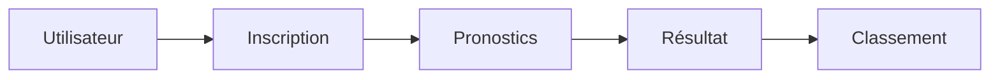

# Bienvenue sur l'application SouthParkPWA!

SouthParkPWA est une application de pronostics entre amis. Elle a été développé en **React** pour le front, et avec **NodeJS** pour l'api ainsi qu'une base de donnée **MongoDB**, hébergée sur **MongoAtlas**.

Pour les résultats sportifs, nous avons utilisé **[APIFootball]([https://apifootball.com/documentation/](https://apifootball.com/documentation/))**, qui donne toutes les statistiques sur des matchs de foot que nous utilisons.

Pour les notifications, nous avons utilisé **Firebase**.

# Fonctionnalités de l'application

Fonctionnalité:

- Connexion

- Création de compte

- Page profil

- Club favori (2 fois plus de point)

- Création de groupe (partage de code entre amis)

- Celui qui crée le groupe choisi la League sur laquelle il souhaite faire ces pronostiques

- Pronostic sur les 10 match de la journée du championnat sélectionné( score )

- Le nombre de point varie selon équipe sur laquelle l'utilisateur mise

- Fin des paris avant le début du premier match de la journée

- Notification de fin de journée

- Résultat à la fin du dernier match de la journée

- Résultat stat

- Trophée de résultat

- Stat sur le profil

Gain:

- Mise à l'entrée du groupe (simple value - le gagnant prend 60%, le 2e 30% et l'entreprise récupère 10%)

- Boost ( si l'équipe gagne tu prends des points supplémentaire)

> Ces fonctionnalités sont les fonctionnalités prévues pour l'application, elles n'ont pas pu toutes être implémentés.

## Mise en production

Vous pouvez utiliser l'api via cette url: http://51.254.118.15:3456

L'application est elle disponible sur cette url: http://51.254.118.15:7890

## Lancement du projet

Pour lancer le projet, veuillez, dans un premier temps, cloner le projet avec cette commande:

`git clone https://github.com/VictorLrd/SouthParkPWA`

Une fois le projet récupéré, veuillez entrer dedans et lancer les commandes suivantes:

`npm i`
`cd api`
`npm i`

Il ne vous reste plus qu'à lancer l'application, pour cela lancer l'api et l'app avec cette commande:

`npm run start`

L'application tourne sur le port 3000, cliquez [ici]([localhost:3000/login](localhost:3000/login)) une fois lancé pour y accéder.

## Pour lancer le projet en prod

Veuillez lancer la commande:

`npm run build`

Puis à l'aide d'un utilitaire comme PM2, lancer la commande :

`pm2 start server.js --name="SouthParkPWA"`

Votre application est maintenant disponible pour tous.

## Parcours utilisateur

